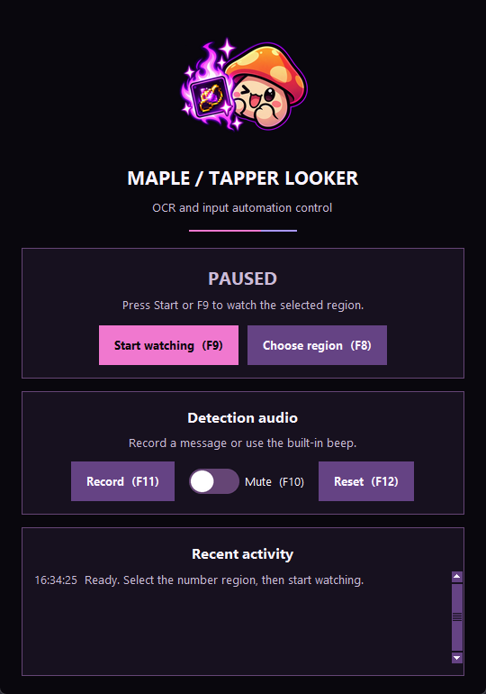

<p align="center">
  
</p>

<h1 align="center">MapleTapperLooker</h1>

<p align="center">
  A Windows screen watcher that detects <code>+&lt;number&gt;</code> values, plays an alert, and stops automated input.
</p>

<p align="center">
  <a href="https://github.com/dusa97/MapleTapperLooker/releases/latest">Download for Windows</a> ·
  <a href="#quick-start">Quick start</a> ·
  <a href="https://github.com/dusa97/MapleTapperLooker/issues">Report an issue</a>
</p>

<p align="center">
  <a href="https://github.com/dusa97/MapleTapperLooker/actions/workflows/release.yml"></a>
</p>

## Overview

Select a screen region, such as a game's Combat Power Change field. MapleTapperLooker uses Tesseract OCR to detect positive values such as `+538,683`.

- Move or resize the detection region across multiple monitors.
- Start and stop detection with global keyboard shortcuts.
- Automate Enter presses and left-clicks, or use detection alone.
- Hear a beep or your recorded message when a value is detected.
- View status and the six most recent detections or errors in a compact dark window.

A confirmed detection plays one alert and pauses detection and automated input. Press **F9** to resume.

### Screenshot

<p align="center">
  
</p>

*The actual Windows control window, shown with detection paused.*

## Quick start

**Requirements:** Windows and [Tesseract OCR](https://github.com/UB-Mannheim/tesseract/wiki). The executable does not require Python.

1. Install Tesseract OCR. The application checks `PATH` and `C:\Program Files\Tesseract-OCR\tesseract.exe`.
2. Download `MapleTapperLooker.exe` from the [latest release](https://github.com/dusa97/MapleTapperLooker/releases/latest).
3. Put the executable in a folder that permits file writes. Open it; Windows can request administrator permission.
4. On first launch, click-drag over the number to watch. Release to save the region; detection stays paused.
5. Click **Start watching**, then click your game target during the three-second countdown. Alternatively, focus the game and press **F9**.

> [!WARNING]
> By default, starting detection also sends repeated Enter presses and left-clicks.
> Focus the intended target before starting. Press **F9** to stop, or close the control window to exit.
> Use automation only where the target application's rules permit it.

For detection without automated input, run this command from the executable's folder:

```powershell
.\MapleTapperLooker.exe --no-enter-spam
```

The control window cancels a start if it still has focus. Detection and automated input start paused on each launch.

## Controls

Press and release each hotkey.

| Key | Action |
| --- | --- |
| **F8** | Pause detection and select a new region. |
| **F9** | Start or stop detection and, unless disabled, automated input. |
| **F10** | Mute or unmute both the beep and recorded message. |
| **F11** | Start recording; press again to save the message. |
| **F12** | Delete the message and restore the beep. Cancel any unfinished recording and stop message playback. |

All five hotkeys work with `--no-enter-spam`. The application blocks F8, F11, and F12 from reaching other programs.

### Select or adjust a region

1. Click **Choose region** or press **F8** to hide the current box and open the selector.
2. Click-drag over the number. Select an area of at least 20 × 20 pixels; smaller drags allow another attempt.
3. Drag the violet border to move the saved box, or drag a corner handle to resize it.
4. Focus the target application and press **F9** to resume.

Each F8 press clears the current selection attempt, including an unfinished drag. **Escape** cancels selection and restores the previous region.
On first launch, or with `--reselect`, Escape exits the initial selector instead.

The selector covers all monitors. Selection pauses detection and stops automated input; neither restarts automatically.
The region is saved in `last_region.json` beside the script or executable.
Double-clicking the overlay does not close the application; close the control window instead.

### Play a random video

Click **i'm bored** to play one random video with sound in the attached right-side panel.
The executable includes the videos. No separate folder is required.
To use your own collection, create `videos/` beside `MapleTapperLooker.exe` and put video files there.
This external folder replaces the bundled collection. Source installations use `videos/` beside `main.py`.

The panel closes when playback ends. Click **Close video** to stop it early.
The panel moves with the application. Detection audio mute does not mute video sound.
Supported file extensions are `.mp4`, `.mkv`, `.mov`, `.avi`, `.webm`, and `.m4v`.
Missing files and playback errors appear in **Recent activity**.
Source installations require `pip install -r requirements.txt` after this update.

### Record a detection message

1. Press **F11** to record from the default microphone.
2. Wait for `REC - F11: stop` in Recent activity, then speak.
3. Press **F11** again to save the message.
4. Start detection to hear the message on the next confirmed match.

Repeat to replace the message. Press **F12** or click **Reset** to restore the beep without restarting.
Reset does not change the mute setting.

The message stays in `detection_message.wav` beside the script or executable, including after restart.
A failed recording keeps the previous message. Closing the application during recording discards the unfinished replacement.
Detection audio is silent during recording. Recording uses Windows audio APIs and needs no additional Python dependency.

## Run from source

Use Windows, Tesseract OCR, and Python. The release workflow builds and tests with **Python 3.11**.

1. Clone the repository:

   ```powershell
   git clone https://github.com/dusa97/MapleTapperLooker.git
   cd MapleTapperLooker
   ```

2. Create a virtual environment and install dependencies:

   ```powershell
   python -m venv .venv
   .\.venv\Scripts\python.exe -m pip install -r requirements.txt
   ```

3. Start the application without a terminal:

   ```powershell
   .\.venv\Scripts\pythonw.exe main.py
   ```

Use `.\.venv\Scripts\python.exe main.py` for terminal diagnostics.
You can also double-click `MapleTapperLooker.pyw` if its associated Python installation has the required dependencies.
The packaged executable runs without a terminal.

### Command-line options

These options also work with `MapleTapperLooker.exe`.

| Option | Purpose |
| --- | --- |
| `--no-enter-spam` | Disable automated input; F9 still controls detection. |
| `--reselect` | Select a new region instead of loading the saved one. |
| `--region L T W H` | Set the region's left, top, width, and height in pixels. |
| `--no-elevate` | Skip the automatic administrator permission request. Hotkeys can fail when an elevated game has focus. |
| `--help` | List all options, including input intervals and configurable hotkeys. |

Example: select a new region and use detection without automated input.

```powershell
.\.venv\Scripts\python.exe main.py --reselect --no-enter-spam
```

## Troubleshooting

| Problem | Check or action |
| --- | --- |
| Tesseract is missing or unavailable | Read the diagnostic in **Recent activity**. Install Tesseract at the standard path or add it to `PATH`, then restart the application. |
| Start is cancelled | Click the game target during the countdown, or focus the game before pressing F9. |
| F9 does not work over an elevated game | Allow the application's administrator permission request. Do not use `--no-elevate` for that session. |
| Recording fails | Enable microphone access for desktop applications in Windows Settings. Check the default microphone and application folder write permissions. |
| Reset cannot delete the message | Read the error in **Recent activity**, correct the file-access problem, and press F12 again. |

## Development

### Run checks

Run from the repository root after installing dependencies:

```powershell
.\.venv\Scripts\python.exe -m unittest discover -v
powershell -NoProfile -File tests/test_release_notes.ps1
```

Tests mock audio devices. Check microphone recording and playback manually with the [recording steps](#record-a-detection-message).

### Build and releases

Each push to `main` runs tests, builds the executable with `MapleTapperLooker.spec`, and publishes a release only after success.
You can also run **Windows release** manually from the repository's **Actions** tab on `main`.

To build locally after installing dependencies:

```powershell
.\.venv\Scripts\python.exe -m pip install pyinstaller==6.16.0
.\.venv\Scripts\python.exe -m PyInstaller --clean --noconfirm MapleTapperLooker.spec
```

The executable is written to `dist/MapleTapperLooker.exe`. Tesseract must still be installed separately.

### Repository layout

| Path | Contents |
| --- | --- |
| `main.py`, `recorded_alert.py`, `MapleTapperLooker.pyw` | Application, recorded audio support, and launcher. |
| `assets/` | Application logo, icon, and README screenshot. |
| `tests/` | Python tests and release-note checks. |
| `.github/workflows/` | Release automation. |
| `MapleTapperLooker.spec`, `requirements.txt` | Build settings and dependencies. |

## Support and contributions

[Open an issue](https://github.com/dusa97/MapleTapperLooker/issues) for a bug report or feature request.
Include your Windows version, application release, reproduction steps, and relevant Recent activity messages.
Remove private information from screenshots before posting.

For code changes, keep pull requests focused and run the checks above. Include a screenshot when a change affects the control window.

## License

This repository does not currently include a license file. No open-source license is granted here; ask the owner before reuse or redistribution.
